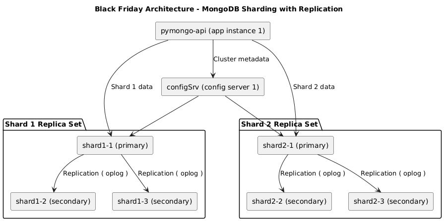
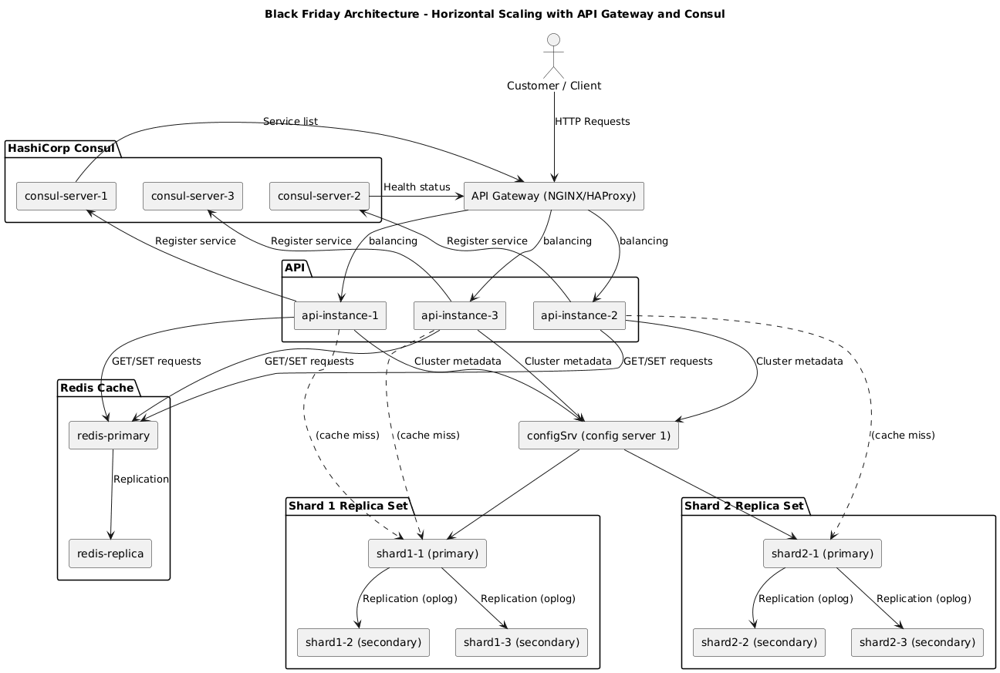
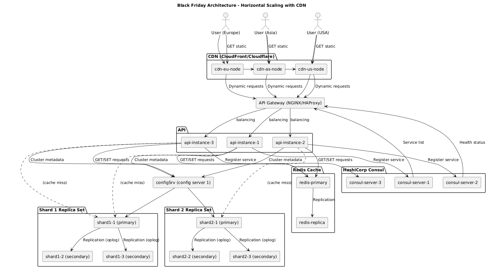

# Архитектурные решения (ADR)

## Принятые решения по архитектуре

### 1. Первый вариант: Единый монолитный API-сервер

**Документация:** [architecture.puml](./schemas/architecture.puml)  
**Схема:** 

**Описание:**  
Начальная архитектура с одним API-сервером, который напрямую взаимодействует с MongoDB.  
**Анализ:** Простая, но не масштабируемая — единственный инстанс=create single point of failure, нет горизонтального масштабирования.

---

### 2. Второй вариант: MongoDB Replication (Primary-Secondary)

**Документация:** [architecture-replication.puml](./schemas/architecture-replication.puml)  
**Схема:** 

**Описание:**  
Добавлен репликационный набор MongoDB с primary иsecondary инстансами.  
**Анализ:** Улучшает отказоустойчивость — при падении primary резервныйbecomes primary. Однако однопоточная запись на primary ограничивает пропускную способность.

---

### 3. Третий вариант: MongoDB Sharding с Replication

**Документация:** [architecture-sharded.puml](./schemas/architecture-sharded.puml)  
**Схема:** 

**Описание:**  
Массивная база данных с шардированием по полю `age` (hash-based) и репликацией.  
**Анализ:** Горизонтальное масштабирование данных. Шарды распределяют нагрузку.  
**MongoDB шarding configuration:**  
- Hash-based sharding на поле `age` с 2 шардами  
- Shard1: 521 документов, Shard2: 479 документов (равномерное распределение)  
- Каждый шард — репликационный набор с primary и secondary узлами

---

### 4. Четвёртый вариант: Горизонтальное масштабирование с API Gateway и Consul

**Документация:** [architecture-scaling.puml](./schemas/architecture-scaling.puml)  
**Схема:** 

**Описание:**  
Реализовано горизонтальное масштабирование приложения:
- **API Gateway** (NGINX/HAProxy) — распределение трафика между несколькими инстансами API
- **Consul** — Service Discovery для регистрации и обнаружения инстансов
- **Redis Cache** — кэширование частых запросов

**Анализ:**  
Решает проблемы:
- Простоев при перезапуске (нужен как минимум 2 инстанса)
- Ограничения одного инстанса по нагрузке

---

### 5. Пятый вариант: CDN для доставки статического контента

**Документация:** [architecture-cdn.puml](./schemas/architecture-cdn.puml)
**Документация:** [scheme-all.drawio](./schemas/scheme-all.drawio)    
**Схема:** 

**Описание:**  
Добавлен CDN (CloudFront/Cloudflare) с узлами в разных регионах (EU, Asia, USA).  
**Анализ:**  
- Пользователи получают статику из ближайшего CDN узла (низкая задержка)
- Динамические запросы идут на API Gateway
- Ускорение доставки контента глобальным пользователям

---

## Реляционная схема MongoDB для коллекций

### Коллекция `products`

**Атрибуты:**
- `_id` — уникальный идентификатор товара
- `name` — наименование
- `category` — категория товара
- `price` — цена
- `stock` — остаток в каждой геозоне (embedded документ или массив)
- `attributes` — дополнительные (цвет, размер)

**Шард-ключ:** `{ category: "hashed" }`

**Обоснование:**
- Хэш-шардирование обеспечивает равномерное распределение документов по шардам
- Частые запросы по категориям — хэш-ключ не мешает фильтрации по точному значению
- Остатки обновляются часто — хэш распределяет нагрузку обновлений по всем шардам
- **Важно:** При неравномерном распределении запросов (например, 70% на "Электронику") возможна перегрузка одного шарда, смотрите раздел "Мониторинг и устранение горячих шардов"

**Пример:**
```javascript
sh.shardCollection("somedb.products", { category: "hashed" })
```


## Задание 7. Проектирование схем коллекций для шардирования данных

---

### Коллекция `orders`

**Атрибуты:**
- `_id` — уникальный идентификатор заказа
- `user_id` — идентификатор клиента
- `created_at` — дата и время оформления
- `items` — список заказанных товаров и их цены
- `status` — статус заказа
- `total_amount` — общая сумма заказа
- `region` — геозона заказа

**Шард-ключ:** `{ user_id: "hashed" }`

**Обоснование:**
- Хэш-шардирование по `user_id` равномерно распределяет заказы по шардам
- Даже если пользователи делают заказы в одно и то же время (например, Black Friday), хэш предотвращает "горячие" шарды
- Операция `find({ user_id: X })` эффективна —MongoDB может направить запрос на конкретный шард
- Compound ключ с хэшем (`user_id + created_at`) не нужен, так как порядок заказов не критичен для производительности

**Пример:**
```javascript
sh.shardCollection("somedb.orders", { user_id: "hashed" })
```

---

### Коллекция `carts`

**Атрибуты:**
- `_id` — уникальный идентификатор корзины
- `user_id` — идентификатор пользователя (nullable для гостей)
- `session_id` — ID сессии для гостей
- `items` — массив товаров `{ product_id, quantity }`
- `status` — "active" | "ordered" | "abandoned"
- `created_at`, `updated_at`
- `expires_at` — TTL для автоочистки

**Шард-ключ:** `{ user_id: "hashed" }`

**Обоснование:**
- Все активные корзины одного пользователя должны находиться на одном шарде для эффективного слияния гостевой и пользовательской корзин
- Хэш-шардирование равномерно распределяет корзины по шардам
- Проверка `{ user_id, status: "active" }` эффективна —MongoDB знает, на каком шарде искать

**Особенности для гостей:**
- Для гостей `user_id: null`, поэтому все гостевые корзины попадут на один шард
- Можно использовать `session_id` как альтернативный шард-ключ для гостей

**Пример:**
```javascript
sh.shardCollection("somedb.carts", { user_id: "hashed" })

// Индекс для поиска активных корзин
db.carts.createIndex({ user_id: 1, status: 1 })
db.carts.createIndex({ session_id: 1, status: 1 })
```

---

## Задание 8. Выявление и устранение «горячих» шардов

### Проблема: Перегрузка шарда из-за популярной категории

Из-за категории "Электроника" 70% запросов приходились на один шард, несмотря на хэш-шардирование. Это произошло потому, что:

1. **Неравномерное распределение нагрузки** — хэш равномерно распределяет данные, но нагрузка зависит от запросов
2. **Горячая категория** — "Электроника" популярнее других, поэтому запросы к ней создают перегруз

---

### Метрики мониторинга

#### 1. **Загрузка на шард**
```javascript
// Количество запросов на каждой shard (через profiling)
db.adminCommand({ shardStats: 1 })

// Использование CPU на каждом шарде
db.adminCommand({ serverStatus: 1 }).metrics.operation
```

#### 2. **Распределение запросов по категориям**
```javascript
// Подсчет запросов по категориям
db.products.aggregate([
  { $group: { _id: "$category", count: { $sum: 1 } } },
  { $sort: { count: -1 } }
])
```

#### 3. **Shard health**
```javascript
// Размер данных на каждом шарде
db.adminCommand({ listShards: 1 })

// Количество документов на каждом шарде
```

#### 4. **Oplog lag** (для репликационных наборов)
```javascript
rs.printReplicationInfo()
rs.printSecondaryReplicationInfo()
```

#### 5. **Количество соединений на шард**
```javascript
db.adminCommand({ connPoolStats: 1 })
```

---

### Механизмы автоматического перераспределения

#### 1. **Вложенные документы для популярных категорий**
Для категории "Электроника" использовать вложенные документы (sub-sharding):

```javascript
// Вместо одного поля category использовать композитный ключ
// { category: "Электроника", region: "Moscow" }
// Поддержка мульти-регионов внутри популярной категории
sh.shardCollection("somedb.products", { 
  category: 1, 
  region: 1 
})
```

#### 2. **Кэширование популярных категорий в Redis**
```javascript
# Пример: кэширование запросов к популярной категории
redis.set("products:Electronics", json.dumps(products), ex=300)
```

#### 3. **Динамическая балансировка через балансер**
```javascript
// Включить автоматический балансировщик
sh.setBalancerState(true)

// Настроить окно балансировки (не пиковые часы)
sh.setBalancerWindow({ start: "02:00", stop: "06:00" })

// Проверить статус балансировки
sh.status()
```

#### 4. **Ручное перераспределение (moveChunk)**
```javascript
// Переместить чанк с горячего шарда на другой
sh.moveChunk("somedb.products", { category: HashOf("Electronics") }, "shard2")
```

#### 5. **Авто разбиение чанков по границам**
```javascript
// Разделить большие чанки
db.adminCommand({ split: "somedb.products", middle: { category:_HASH_ } })

// Принудительное перемещение после split
db.adminCommand({ moveChunk: "somedb.products", find: { category: HASH }, to: "shard2" })
```

#### 6. **Zoned Tag Sharding**
Механизм привязки конкретных диапазонов данных к шардам с тегами (например, по регионам).

**Концепция:**
- Шарды получают теги (например, `shard1: "eu"`, `shard2: "us"`, `shard3: "asia"`)
- Popular category "Electronics" реплицируется на все шарды с разными тегами
- Для read-запросов MongoDB направляет запрос к шарду с нужным тегом (по геолокации пользователя)

**Пример конфигурации:**
```javascript
// 1. Создать теги для шардов
sh.addTaggedShard("shard1", { region: "eu" })
sh.addTaggedShard("shard2", { region: "us" })
sh.addTaggedShard("shard3", { region: "asia" })

// 2. Определить зоны для популярной категории
sh.addZoneRange("somedb.products", { category: "Electronics", region: "eu" }, { category: "Electronics", region: "eu" }, "shard1")
sh.addZoneRange("somedb.products", { category: "Electronics", region: "us" }, { category: "Electronics", region: "us" }, "shard2")
sh.addZoneRange("somedb.products", { category: "Electronics", region: "asia" }, { category: "Electronics", region: "asia" }, "shard3")

// 3. Настроить приложение на использование readPreference с tag set
db.products.find({ category: "Electronics" }).readPref("secondaryPreferred", [{ region: "eu" }])

// 4. Для балансировки чанков с зонами
sh.settings.balance zones_enabled: true
```

**Преимущества:**
- Горизонтальное масштабирование популярных категорий без кэша
- Geographically aware routing: пользователи из EU читают из EU-реплики (низкая задержка)
- Автоматическое распределение нагрузки между шардами по тегам

**Ограничения:**
- Избыточность данных (дублирование популярных категорий на всех шардах)
- Сложность поддержки согласованности между зонами (нужны read repair или TTL)
- MongoDB требует полного покрытия всех чанков зонами или отсутствие зон

---

### Проактивные меры

1. **Redis cache для популярных категорий** — кэшировать запросы к "Электронике"
2. **Region-based sub-sharding** — добавить поле `region` к шард-ключу
3. **Zoned tag sharding для горячих категорий** — реплицировать популярные категории на все шарды с разными тегами
4. **Alerting на нагрузку** — триггер при превышении 70% нагрузки на один шард
5. **Regular chunk balancing** — запланированная балансировка через `balancer`
6. **TTL индексы для старых данных** — архивировать старые заказы

---
### Пример мониторинга в реальном времени

```javascript
// Мониторинг распределения данных по шардам
db.adminCommand({ shardStatus: 1 }).shards

// Проверка chunk distribution
db.adminCommand({ listShards: 1 })

// Отслеживание oplog lag для репликаций
db.getSiblingDB("local").oplog.rs.stats()
```

---

## Задание 9. Настройка чтения с реплик и консистентность

### Коллекция `products`

| Операция чтения | Primary / Secondary | Допустимая задержка | Обоснование |
|----------------|---------------------|---------------------|-------------|
| Просмотр списка товаров | Secondary | <= 1 сек | Нет критичной требовательности к актуальности списка, допустимо отображение устаревших названий/цен |
| Просмотр деталей товара | Primary | 0 сек | Пользователь может сравнивать цену с остатком, устаревшая цена приведёт к ошибке оформления |
| Редактирование товара (админ) | Primary | 0 сек | Требуется точная актуальная информация |
| Поиск по категориям | Secondary | <= 2 сек | Оптимизация нагрузки на primary, допустима небольшая задержка |

### Коллекция `orders`

| Операция чтения | Primary / Secondary | Допустимая задержка | Обоснование |
|----------------|---------------------|---------------------|-------------|
| История заказов пользователя | Secondary | <= 5 сек | Статусы заказов обычно обновляются раз в минуту, допустима задержка |
| Текущий статус заказа (before payment) | Primary | 0 сек | Критично: пользователь не должен оформить заказ, если статус уже "ordered" |
| Панель администратора | Primary | 0 сек | Требуется точная актуальная информация для принятия решений |

### Коллекция `carts`

| Операция чтения | Primary / Secondary | Допустимая задержка | Обоснование |
|----------------|---------------------|---------------------|-------------|
| Отображение корзины пользователю | Primary | 0 сек | Критично: показ устаревших товаров или цен вызовёт ошибку оформления |
| Добавление/удаление товара | Primary | 0 сек | Запись всегда идёт на primary |
| Аналитика abandoned корзин | Secondary | <= 10 сек | batch-обработка, не влияет на пользователей |

### Обоснование общего подхода

**Требования к консистентности:**
- **Strong consistency** — операции, связанные с деньгами и заказами (цена, статус "active/ordered")
- **Eventual consistency** — справочная информация (каталог, история заказов)

**Частота обновлений:**
- `products` — частые (на складе), но читаемых запросов больше — Secondary разгружает primary
- `orders` — редкие обновления, много чтений — Secondary допустим для истории
- `carts` — частые чтения и записи — только Primary, чтобы избежать несогласованности

**Бизнес-логика:**
- Риск продажи недоступного товара → только Primary для `products.stock` и `carts`
- Отображение устаревшего статуса → Secondary допустим для истории, но не для оформления

---

## Задание 10. Миграция на Cassandra: модель данных, стратегии репликации и шардирования

### Задание 10.1: Выбор данных для миграции

**Важно:** MongoDB с версии 4.2 поддерживает MULTI-DOCUMENT ACID транзакции в шардированных кластерах. Это позволяет надёжно создавать заказы вместе с обновлением остатков в одной транзакции — риск продажи недоступного товара исключается.

#### Сущности, НЕ подходящие для Cassandra

| Сущность | Причина |
|---------|---------|
| **Продукты (products)** | Нужна транзакционная логика: создание заказа + обновление остатков в одной ATOMIC операции. Cassandra не поддерживает транзакции. |
| **Заказы (orders)** | Нужна согласованность: заказ должен быть создан, когда остатки ещё актуальны (race condition при параллельных заказах). |

#### Критически важные сущности для Cassandra

| Сущность | Приоритет | Обоснование |
|---------|-----|---------|
| **Корзины (carts)** | ⭐⭐⭐⭐⭐ | Высокая частота записи (каждое добавление/удаление), требует быструю запись и горизонтальное масштабирование без downtime. Нет критичной транзакционной логики. |
| **Пользовательские сессии** | ⭐⭐⭐⭐ | Требует быстрых чтения/записи, TTL поддержка в Cassandra встроена. |

#### Обоснование выбора Cassandra

- **Leaderless replication** — 3+ реплики, отказоустойчивость при падении узлов
- **No full resharding** — добавление узлов не требует перемещения данных
- **TTL support** — автоматическая очистка сессий и корзин
- **Write-heavy workload** — оптимизирована для 50k+ writes/sec
- **Геораспределение** — быстрый доступ к корзинам пользователей в любом регионе

---

### Задание 10.2: Концептуальная модель (только для корзин и сессий)

**Важно:** `products` и `orders` остаются в MongoDB благодаря поддержке ACID-транзакций в шардированных кластерах (начиная с версии 4.2).

#### Таблица: `user_cart`

```sql
CREATE TABLE user_cart (
    user_id UUID,
    session_id UUID,
    product_id UUID,
    quantity INT,
    added_at TIMESTAMP,
    PRIMARY KEY ((user_id), added_at, product_id)
) WITH CLUSTERING ORDER BY (added_at DESC);
```

**Partition key:** `user_id`
**Clustering key:** `added_at`, `product_id`

**Обоснование:**
- Все корзины одного пользователя в одной партиции
- Сортировка по времени добавления для отображения новых первыми
- No hot partitions — равномерное распределение по user_id (UUID)

#### Таблица: `user_sessions`

```sql
CREATE TABLE user_sessions (
    user_id UUID,
    session_id UUID,
    data TEXT,
    created_at TIMESTAMP,
    PRIMARY KEY ((user_id), created_at)
) WITH TTL = 3600;
````

**Partition key:** `user_id`
**Clustering key:** `created_at`
**TTL:** 3600 секунд (1 час для неактивных сессий)

**Обоснование:**
- TTL встроена в Cassandra — автоочистка истёкших сессий
- Быстрый доступ по user_id для восстановления состояния

---

### Задание 10.3: Стратегии обеспечения целостности данных для Cassandra

| Таблица | Стратегия | Обоснование |
|---------|-----|--|
| `user_cart` | Hinted Handoff + Read Repair | Критично для записи — нельзя потерять добавление товара. Read Repair поддерживает согласованность. |
| `user_sessions` | Read Repair + TTL | Сессии не критичны к потере — приоритет доступности. TTL обеспечивает автоочистку. |

#### Уровни согласованности

```cql
-- Для записи в корзину (согласованность важна)
CONSISTENCY LOCAL_QUORUM

-- Для чтения сессий (доступность важнее)
CONSISTENCY ONE
```

---

### Задание 10.4: ACID-транзакции в MongoDB для заказов

**Проблема:** При создании заказа нужно одновременно:
1. Создать документ заказа
2. Уменьшить остаток товара на складе

**Решение:** MongoDB поддерживает MULTI-DOCUMENT ACID-транзакции в шардированных кластерах (начиная с версии 4.2).

**Пример транзакции:**
```javascript
const session = db.getMongo().startSession();
session.startTransaction();

try {
  // Создание заказа
  session.getDatabase("somedb").orders.insertOne({
    user_id: userId,
    items: cartItems,
    status: "created",
    created_at: new Date(),
    total_amount: calculateTotal(cartItems)
  });

  // Обновление остатков
  for (let item of cartItems) {
    session.getDatabase("somedb").products.updateOne(
      { _id: item.product_id },
      { $inc: { stock: -item.quantity } }
    );
  }

  session.commitTransaction();
} catch (error) {
  session.abortTransaction();
  throw error;
} finally {
  session.endSession();
}
```

**Обоснование:**
- **Изоляция** — параллельные заказы не влияют друг на друга
- **Атомарность** — либо всё успешно, либо ничего не изменено
- **Согласованность** — остатки никогда не могут уйти в минус